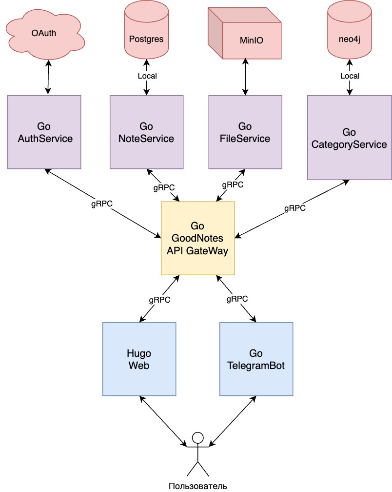

# GoodNotes

GoodNotes - телеграмм бот(веб версия в дальнейшем), который поможет вам управлять задачами, устанавливать напоминания и создавать быстрые заметки.
Он предоставляет функции по созданию, редактированию и отслеживанию задач, а также возможность создавать заметки и
сохранять их в удобном формате. Бот позволяет быть в курсе всех своих задач и не пропустить ни одного важного события,
благодаря функции напоминаний. Начните использовать GoodNotes уже сегодня и станьте более продуктивным!

# Взаимодействие микросервисов:

[//]: # (## Пример таблицы с описанием Images)

[//]: # (## Hosting your own GoodNotes)

[//]: # ()
[//]: # (You're going to need these docker images.)

[//]: # ()
[//]: # (| Parts                                                                  | Docker CI Build                                                                                                                                                                              | Docker Image                                                                                                                                                                                                  |)

[//]: # (| ---------------------------------------------------------------------- | -------------------------------------------------------------------------------------------------------------------------------------------------------------------------------------------- | ------------------------------------------------------------------------------------------------------------------------------------------------------------------------------------------------------------- |)

[//]: # (| [MariaDB]&#40;https://mariadb.org/&#41;                                        |                                                                                                                                                                                              | [![Docker Image Size]&#40;https://img.shields.io/docker/image-size/_/mariadb/latest?style=flat-square&#41;]&#40;https://hub.docker.com/_/mariadb&#41;                                                                         |)

[//]: # (| [Adminer]&#40;https://www.adminer.org/&#41;                                    |                                                                                                                                                                                              | [![Docker Image Size]&#40;https://img.shields.io/docker/image-size/_/adminer/latest?style=flat-square&#41;]&#40;https://hub.docker.com/_/adminer&#41;                                                                         |)

[//]: # (| [redis]&#40;https://redis.io/&#41;                                             |                                                                                                                                                                                              | [![Docker Image Size]&#40;https://img.shields.io/docker/image-size/_/redis/latest?style=flat-square&#41;]&#40;https://hub.docker.com/_/redis&#41;                                                                             |)

[//]: # (| [liresolr]&#40;https://github.com/soruly/liresolr&#41;                         | [![GitHub Workflow Status]&#40;https://img.shields.io/github/actions/workflow/status/soruly/liresolr/docker-image.yml?style=flat-square&#41;]&#40;https://github.com/soruly/liresolr/actions&#41;                 | [![Docker Image Size]&#40;https://img.shields.io/docker/image-size/soruly/liresolr/latest?style=flat-square&#41;]&#40;https://github.com/soruly/liresolr/pkgs/container/liresolr&#41;                                         |)

[//]: # (| [trace.moe-www]&#40;https://github.com/soruly/trace.moe-www&#41;               | [![GitHub Workflow Status]&#40;https://img.shields.io/github/actions/workflow/status/soruly/trace.moe-www/docker-image.yml?style=flat-square&#41;]&#40;https://github.com/soruly/trace.moe-www/actions&#41;       | [![Docker Image Size]&#40;https://img.shields.io/docker/image-size/soruly/trace.moe-www/latest?style=flat-square&#41;]&#40;https://github.com/soruly/trace.moe-www/pkgs/container/trace.moe-www&#41;                          |)

[//]: # (| [trace.moe-api]&#40;https://github.com/soruly/trace.moe-api&#41;               | [![GitHub Workflow Status]&#40;https://img.shields.io/github/actions/workflow/status/soruly/trace.moe-api/docker-image.yml?style=flat-square&#41;]&#40;https://github.com/soruly/trace.moe-api/actions&#41;       | [![Docker Image Size]&#40;https://img.shields.io/docker/image-size/soruly/trace.moe-api/latest?style=flat-square&#41;]&#40;https://github.com/soruly/trace.moe-api/pkgs/container/trace.moe-api&#41;                          |)

[//]: # (| [trace.moe-media]&#40;https://github.com/soruly/trace.moe-media&#41;           | [![GitHub Workflow Status]&#40;https://img.shields.io/github/actions/workflow/status/soruly/trace.moe-media/docker-image.yml?style=flat-square&#41;]&#40;https://github.com/soruly/trace.moe-media/actions&#41;   | [![Docker Image Size]&#40;https://img.shields.io/docker/image-size/soruly/trace.moe-media/latest?style=flat-square&#41;]&#40;https://github.com/soruly/trace.moe-media/pkgs/container/trace.moe-media&#41;                    |)

[//]: # (| [trace.moe-worker-hasher]&#40;https://github.com/soruly/trace.moe-worker&#41;  | [![GitHub Workflow Status]&#40;https://img.shields.io/github/actions/workflow/status/soruly/trace.moe-worker/docker-image.yml?style=flat-square&#41;]&#40;https://github.com/soruly/trace.moe-worker/actions&#41; | [![Docker Image Size]&#40;https://img.shields.io/docker/image-size/soruly/trace.moe-worker-hasher/latest?style=flat-square&#41;]&#40;https://github.com/soruly/trace.moe-worker/pkgs/container/trace.moe-worker-hasher&#41;   |)

[//]: # (| [trace.moe-worker-loader]&#40;https://github.com/soruly/trace.moe-worker&#41;  | [![GitHub Workflow Status]&#40;https://img.shields.io/github/actions/workflow/status/soruly/trace.moe-worker/docker-image.yml?style=flat-square&#41;]&#40;https://github.com/soruly/trace.moe-worker/actions&#41; | [![Docker Image Size]&#40;https://img.shields.io/docker/image-size/soruly/trace.moe-worker-loader/latest?style=flat-square&#41;]&#40;https://github.com/soruly/trace.moe-worker/pkgs/container/trace.moe-worker-loader&#41;   |)

[//]: # (| [trace.moe-worker-watcher]&#40;https://github.com/soruly/trace.moe-worker&#41; | [![GitHub Workflow Status]&#40;https://img.shields.io/github/actions/workflow/status/soruly/trace.moe-worker/docker-image.yml?style=flat-square&#41;]&#40;https://github.com/soruly/trace.moe-worker/actions&#41; | [![Docker Image Size]&#40;https://img.shields.io/docker/image-size/soruly/trace.moe-worker-watcher/latest?style=flat-square&#41;]&#40;https://github.com/soruly/trace.moe-worker/pkgs/container/trace.moe-worker-watcher&#41; |)
